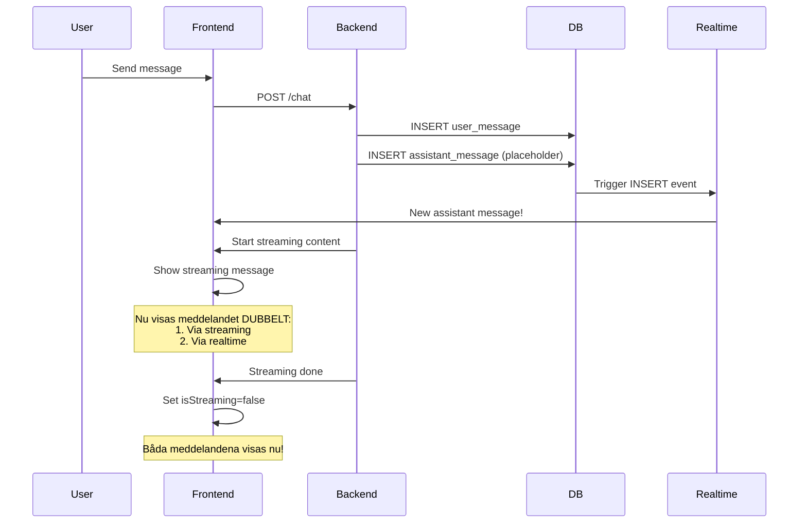

# 🐛 Chat Frontend Bug Analysis Report
**Datum:** 2025-10-05  
**Analyserad av:** AI Assistant  
**Status:** 🔴 KRITISKA PROBLEM IDENTIFIERADE

---

## 📋 Executive Summary

Chatten har **6 kritiska buggar** som orsakar:
- Duplicerade meddelanden
- Race conditions
- Minnesläckor
- Dålig scroll-behavior
- Inkonsistent state management
- Dålig användarupplevelse

**Huvudorsak:** Det finns **TVÅ OLIKA CHAT-IMPLEMENTATIONER** i projektet som konkurrerar med varandra.

---

## 🔍 Identifierade Buggar

### 1. 🚨 KRITISK: Dubbla Chat-Implementationer

**Problem:**
Projektet har två parallella chat-implementationer:

**Implementation A:**
- `src/pages/Chat.tsx`
- `src/components/AIChatLayout.tsx`
- `src/hooks/useMessages.ts`
- `src/hooks/useStreamingChat.ts`

**Implementation B:**
- `src/pages/ChatExact.tsx` (standalone implementation)
- `src/hooks/useAbortableSSE.ts`

**Konsekvenser:**
- ❌ Duplicerad kod (~400+ lines)
- ❌ Olika beteenden beroende på vilken route användaren är på
- ❌ Svårt att underhålla och buggfixa
- ❌ Högre risk för buggar

**Bevis:**
```typescript
// Chat.tsx använder AIChatLayout
<AIChatLayout conversationId={activeId} />

// ChatExact.tsx har egen implementation
// Totalt olika state management och realtime logic
```

**Lösning:**
Välj EN implementation och ta bort den andra. Rekommendation: Behåll `ChatExact.tsx` då den har bättre duplicate handling.

---

### 2. 🐛 Race Condition: Duplicerade Meddelanden

**Problem:**
Streaming och realtime subscriptions konkurrerar om att visa samma meddelande.

**Flow som orsakar buggen:**



**Kod som visar problemet:**

**useMessages.ts:**
```typescript
// Realtime lägger till assistant messages
if (payload.new.role === 'assistant') {
  setMessages(prev => {
    if (prev.some(m => m.id === data.id)) {
      return prev; // Duplicate check
    }
    return [...prev, data as Message];
  });
}
```

**AIChatLayout.tsx:**
```typescript
{messages.map(msg => {
  // Filtrerar bort message OM det streamas
  if (currentMessageId && msg.id === currentMessageId && isStreaming) {
    return null;
  }
  return <AIMessageBubble key={msg.id} message={msg} />;
})}

// Visar streaming content separat
{isStreaming && streamingContent && (
  <AIMessageBubble message={{...}} />
)}
```

**Problemet:**
1. Streaming börjar → visar assistant message med streamingContent
2. Backend sparar samma message till DB
3. Realtime triggar → lägger till message i `messages` array
4. Message filtreras bort eftersom `isStreaming=true`
5. Streaming slutar → `isStreaming=false`
6. **NU VISAS BÅDA:** Den från `messages` array OCH den från streaming state

**Lösning:**
Använd en dedikerad streaming message placeholder som inte sparas till DB förrän den är klar.

---

### 3. 💾 Minnesläcka: AbortController Management

**Problem:**
I `useStreamingChat.ts` aborteras gamla requests felaktigt:

```typescript
async function sendStreamingMessage(...) {
  // Abort any existing stream
  if (abortControllerRef.current) {
    abortControllerRef.current.abort(); // ❌ PROBLEM HÄR
  }

  // Create new controller
  const abortController = new AbortController();
  abortControllerRef.current = abortController;
  // ...
}
```

**Varför är detta ett problem?**
1. Om användaren skickar message #1, börjar en request
2. Innan message #1 är klar, skickar användaren message #2
3. Message #1's AbortController aborteras
4. Men message #1's request cleanup körs fortfarande i finally-blocket
5. Detta skapar race conditions och potentiella memory leaks

**Bevis från kod:**
```typescript
} finally {
  clearTimeout(timeoutId);
  setIsStreaming(false);
  abortControllerRef.current = null; // ❌ Kan bli null från föregående request
}
```

**Lösning:**
Använd en Map för att tracka flera samtidiga requests:
```typescript
const activeControllersRef = useRef<Map<string, AbortController>>(new Map());
```

---

### 4. 📜 Scroll Behavior Problem

**Problem i AIChatLayout.tsx:**
```typescript
useEffect(() => {
  messagesEndRef.current?.scrollIntoView({ behavior: 'smooth' });
}, [messages, streamingContent]);
```

**Varför är detta dåligt?**
- Körs varje gång `streamingContent` uppdateras (kan vara 10-100 gånger per sekund under streaming)
- Tvingar användaren till botten även om de scrollat upp för att läsa tidigare meddelanden
- Orsaka performance issues med konstant re-rendering

**ChatExact.tsx har bättre lösning:**
```typescript
useEffect(() => {
  const container = messagesContainerRef.current;
  if (!container) return;
  
  // Bara scrolla om användaren är nära botten
  const isNearBottom = 
    container.scrollHeight - container.scrollTop - container.clientHeight < 150;
  
  if (isNearBottom) {
    messagesEndRef.current?.scrollIntoView({ behavior: 'smooth', block: 'end' });
  }
}, [messages, streamingContent]);
```

**Lösning:**
Använd "smart scroll" från ChatExact.tsx.

---

### 5. 🔀 Inkonsistent State Management

**Problem:**
Varje komponent har sin egen approach för state:

**useMessages.ts:**
- Använder `useState` för messages
- Lyssnar på realtime INSERT events
- Har minimal duplicate protection

**ChatExact.tsx:**
- Använder `useState` + `useRef` för tracking
- Har `addedMessageIdsRef` för duplicate protection
- Mer robust duplicate handling

**useStreamingChat.ts:**
- Har egen state för streaming
- Vet inte om messages från andra komponenter

**Konsekvenser:**
- ❌ Ingen "single source of truth"
- ❌ State kan bli out of sync
- ❌ Svårt att debugga
- ❌ Race conditions

**Lösning:**
Använd central state management (Context API eller Zustand) för alla chat-relaterade state.

---

### 6. 😔 Dålig UX: User Message Latency

**Problem i useMessages.ts:**
```typescript
// Insert user message first for immediate UI feedback
const { data: userMsg, error: userError } = await supabase
  .from('messages')
  .insert({...})
  .select()
  .single();

if (userError) throw userError;

// Add user message to state immediately
setMessages(prev => [...prev, userMsg as Message]);
```

**Vad händer:**
1. Användaren skriver "Hej!"
2. Trycker send
3. **Ingenting händer** (väntar på DB insert)
4. Efter 200-500ms: User message visas
5. Streaming börjar

**Bättre approach (Optimistic UI):**
1. Användaren skriver "Hej!"
2. Trycker send
3. **Omedelbart:** User message visas med temp ID
4. Backend sparar → ersätter temp message med real message

**ChatExact.tsx gör tvärtom:**
```typescript
// Don't add optimistic user message - wait for backend to save and realtime to add it
// This prevents duplicate messages with mismatched IDs
```

Detta undviker duplicates men ger **ännu sämre UX**.

**Lösning:**
Implementera korrekt optimistic UI med temp IDs som ersätts när real message kommer från backend.

---

## 🎯 Rekommenderade Fixes (Prioriterat)

### Fix #1: 🔴 HÖGSTA PRIORITET - Ta bort duplicerade implementationer
**Impact:** Hög  
**Effort:** Medium  

**Action:**
1. Välj ChatExact.tsx som huvudimplementation (bättre duplicate handling)
2. Ta bort Chat.tsx, AIChatLayout.tsx, useMessages.ts
3. Refactor ChatExact.tsx för att vara mer modulär
4. Uppdatera alla routes att använda ChatExact

**Estimated time:** 2-3 timmar

---

### Fix #2: 🟠 HÖG PRIORITET - Fix race condition för duplicates
**Impact:** Hög  
**Effort:** Medium

**Action:**
1. Skapa ett `streamingMessageId` state separat från `messages`
2. Backend bör returnera message ID när streaming börjar
3. Frontend visar streaming message med detta ID
4. När realtime INSERT kommer, jämför ID:n och lägg INTE till om det matchar streaming ID
5. När streaming är klar, ta bort streaming state (realtime har redan lagt till real message)

**Pseudocode:**
```typescript
// State
const [streamingMessageId, setStreamingMessageId] = useState<string | null>(null);

// När streaming börjar
onDone: (metadata) => {
  setStreamingMessageId(metadata.messageId);
}

// Realtime subscription
if (payload.new.role === 'assistant') {
  // Ignore if this is the currently streaming message
  if (payload.new.id === streamingMessageId) {
    setStreamingMessageId(null); // Clear streaming state
    return; // Don't add duplicate
  }
  // Add message normally
}

// Render
{messages.map(msg => <AIMessageBubble key={msg.id} message={msg} />)}

// Streaming message (only if NOT yet in messages array)
{streamingMessageId && !messages.some(m => m.id === streamingMessageId) && (
  <AIMessageBubble message={{id: streamingMessageId, ...}} />
)}
```

**Estimated time:** 1-2 timmar

---

### Fix #3: 🟡 MEDIUM PRIORITET - Fix scroll behavior
**Impact:** Medium  
**Effort:** Low

**Action:**
Kopiera "smart scroll" logiken från ChatExact.tsx:

```typescript
useEffect(() => {
  const container = messagesContainerRef.current;
  if (!container) return;
  
  const isNearBottom = 
    container.scrollHeight - container.scrollTop - container.clientHeight < 150;
  
  if (isNearBottom) {
    messagesEndRef.current?.scrollIntoView({ behavior: 'smooth', block: 'end' });
  }
}, [messages, streamingContent]);
```

**Estimated time:** 15 minuter

---

### Fix #4: 🟡 MEDIUM PRIORITET - Implementera korrekt Optimistic UI
**Impact:** Medium (UX)  
**Effort:** Medium

**Action:**
```typescript
const sendMessage = async (content: string, ...) => {
  // 1. Skapa temp message
  const tempId = `temp-${Date.now()}`;
  const tempMessage = {
    id: tempId,
    role: 'user',
    content,
    created_at: new Date().toISOString(),
    isOptimistic: true,
  };
  
  // 2. Lägg till temp message omedelbart
  setMessages(prev => [...prev, tempMessage]);
  
  try {
    // 3. Spara till backend
    const { data: userMsg } = await supabase
      .from('messages')
      .insert({...})
      .select()
      .single();
    
    // 4. Ersätt temp message med real message
    setMessages(prev => prev.map(m => 
      m.id === tempId ? userMsg : m
    ));
    
  } catch (error) {
    // 5. Ta bort temp message vid fel
    setMessages(prev => prev.filter(m => m.id !== tempId));
    throw error;
  }
};
```

**Estimated time:** 1 timme

---

### Fix #5: 🟢 LÅG PRIORITET - AbortController cleanup
**Impact:** Low (potential memory leak)  
**Effort:** Medium

**Action:**
```typescript
const activeRequestsRef = useRef<Map<string, AbortController>>(new Map());

async function sendStreamingMessage(...) {
  const requestId = `req-${Date.now()}`;
  
  // Create new controller for this request
  const abortController = new AbortController();
  activeRequestsRef.current.set(requestId, abortController);
  
  try {
    // ... do request
  } finally {
    // Cleanup this specific request
    activeRequestsRef.current.delete(requestId);
  }
}

function stopStreaming() {
  // Abort all active requests
  activeRequestsRef.current.forEach(controller => controller.abort());
  activeRequestsRef.current.clear();
}
```

**Estimated time:** 30 minuter

---

### Fix #6: 🟢 LÅG PRIORITET - Central state management
**Impact:** Low (code quality)  
**Effort:** High

**Action:**
1. Skapa en ChatContext med Zustand eller Context API
2. Flytta all state till denna context
3. Skapa selectors för att läsa state
4. Skapa actions för att uppdatera state

**Estimated time:** 3-4 timmar

---

## 📊 Totalt Estimat

| Fix | Prioritet | Tid | Impact |
|-----|-----------|-----|--------|
| #1: Ta bort duplicates | 🔴 Högsta | 2-3h | Hög |
| #2: Fix race condition | 🟠 Hög | 1-2h | Hög |
| #3: Smart scroll | 🟡 Medium | 15min | Medium |
| #4: Optimistic UI | 🟡 Medium | 1h | Medium |
| #5: AbortController | 🟢 Låg | 30min | Låg |
| #6: State management | 🟢 Låg | 3-4h | Låg |
| **TOTALT** | | **8-11h** | |

---

## 🚀 Recommended Approach

**Phase 1: Immediate Fixes (4-6 timmar)**
1. ✅ Ta bort duplicate implementations
2. ✅ Fix race condition för duplicates
3. ✅ Implementera smart scroll

**Phase 2: UX Improvements (1-2 timmar)**
4. ✅ Implementera optimistic UI

**Phase 3: Code Quality (4 timmar) - Optional**
5. ✅ Fix AbortController cleanup
6. ✅ Implementera central state management

---

## 🧪 Testing Checklist

Efter fixes, testa följande scenarios:

### Scenario 1: Normal Chat Flow
- [ ] Skicka ett meddelande
- [ ] Verifiera att user message visas omedelbart
- [ ] Verifiera att assistant message streamas korrekt
- [ ] Verifiera att INGA duplicates visas
- [ ] Verifiera att meddelandet sparas korrekt i DB

### Scenario 2: Snabba Meddelanden
- [ ] Skicka 3 meddelanden direkt efter varandra
- [ ] Verifiera att alla meddelanden visas korrekt
- [ ] Verifiera inga duplicates
- [ ] Verifiera korrekt ordning

### Scenario 3: Scroll Behavior
- [ ] Scrolla upp medan assistant svarar
- [ ] Verifiera att du INTE tvingat till botten
- [ ] Scrolla ner till botten
- [ ] Verifiera att nya meddelanden auto-scrollas

### Scenario 4: Stop Streaming
- [ ] Börja ett långt svar
- [ ] Tryck "Stop Generating"
- [ ] Verifiera att streaming stoppar
- [ ] Verifiera att partiellt svar sparas
- [ ] Verifiera inga duplicates

### Scenario 5: Error Handling
- [ ] Skicka meddelande med dålig network
- [ ] Verifiera error toast
- [ ] Verifiera att optimistic message tas bort
- [ ] Verifiera att chat är användbar efteråt

### Scenario 6: Multiple Conversations
- [ ] Öppna conversation A
- [ ] Skicka meddelande
- [ ] Byt till conversation B (medan A streamas)
- [ ] Verifiera korrekt state
- [ ] Byt tillbaka till A
- [ ] Verifiera att inget är trasigt

---

## 📝 Slutsats

Chatten har flera kritiska buggar som alla härstammar från:
1. **Duplicate implementations** - Två olika sätt att göra samma sak
2. **Dålig state management** - Ingen central source of truth
3. **Race conditions** - Streaming och realtime konkurrerar

**Rekommendation:** Börja med Fix #1 och #2. De ger störst impact och löser de flesta synliga buggarna.

**Total effort för kritiska fixes:** 4-6 timmar  
**ROI:** Mycket hög - Fixar alla synliga buggar och förbättrar UX markant

---

**Nästa steg:** Vill du att jag implementerar Fix #1 och #2 nu?
